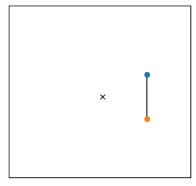
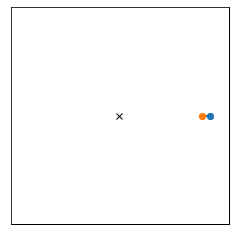
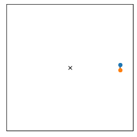
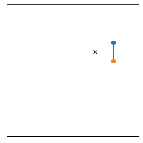

# About Fat Objects in Space

This repository houses a notebook that uses a symplectic integrator to simulate a rigid body (a dumbbell) in the gravitational field of the earth. We compiled this notebook to find an answer to the question: **How does the orientation of a rigid body in space change along its trajectory?** Does it align with its velocity vector or is the initial orientation an invariant?

See the notebook for our scripts and play around on your own!
 - [notebook.ipynb](notebook.ipynb)

**TL;DR** Below we show what happens if the dumbbell is launched with the exact velocity its center of mass would need to stay on a circular orbit if the dumbbell would behave like a point-like particle.

It is noteworthy that this chaotic looking effect reduces if the length of the dumbbell becomes smaller w.r.t. its distance to the planet:

**Just in case you care:** We use a high order symplectic and symmetric integrator, ensure total energy and angular momentum conservation, and do our best to minimize the impact of rounding errors. Therefore, the effect of apsidal precession, for example as shown below

seems to be genuine.
